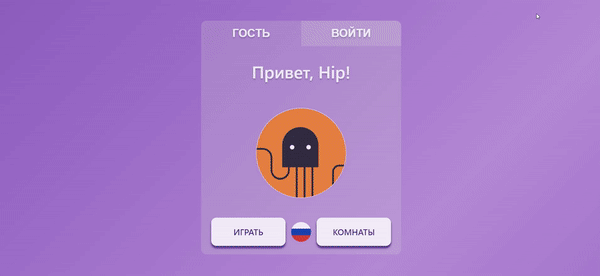

# MMO Game Cities
## What is that?
Responsive, cross-browser SPA.

- Frontend made with Javascript, React and gRPC-web
- [Backend](https://git.yandex-academy.ru/school/2022-09/projects/team19/mmo-towns) made with C++, Python, **[@userver](https://github.com/userver-framework)**

## About this game

Welcome to word chain geography multiplayer online quiz game.
User mission is to name as many cities as possible. Who's the fastest guesser?

## User journey map:

### Registration
  - User can register or login by email.
  - User can login without registration. 
    In this case, he gets random nickname and avatar

### Starting game
  There are two options to start playing:
  - Clicking **PLAY** button (**ИГРАТЬ**)
  - Clicking **ROOMS** button (**КОМНАТЫ**) to choose exact room to start the game

#### PLAY button

  In this case, user joins random room from the list. Avaliable random room fits two criterias:
  - It has empty slot for our user.
  - The game is not started or finished yet.
  
 *As an option, we can set and allow our user to join in-progress games with avaliable slots.*
 
 #### ROOM button
 
 
  
 
 Clicking on this button directs user to avaliable rooms list page.
 Here are two options:
 - User can join one of avaliable rooms which can vary number of players and game language
 - User can create his own room. Number of players and language is set by default.  *As an option, user can set his own settings (In progress)* 
 
  
### Game in-progress

 

- After game slots are filled, server starts game and drops a random city
- All players try to send next city name based on last character of previous city
- Cities are compared with the list of cities in the database
- If there is no such city - answer is not accepted and the user gets no score, game timer is running
- Every city can be used only once during the game. In another case, answer is not accepted and the user gets no score, game timer is running
- If there is a city, the first user named the city gets score. Game timer rolls back to 30 seconds.

### Game is finished

 

- The game ends when no one offers a new city within 30 seconds
*As an option, we can set endgame as one of users gets the exact score.*
- The winner is the user with the highest score.
- From this point, user can join random room again or he can switch to the rooms list.

## Features:
- Large word database: over 5,000 cities
- Customize your gaming experience with unique nickname and avatar
- Easy to step-in, hard to win
- Multiplayer game with random parties or compete against your friends using join room link

## How it works

Under the hood we have an issue: when anyone changes changes the city, we need to share that information with each player.

In case if using REST, it turns to a very expensive decision - polling, which will update information by a concrete interval we set.
Using grpc, we share this information immediately by stream, which shares information instantly.
The user sends new city, backend scores it up and share updayed information about city, score and timer with each user.

But the browser will be unable to get backend, so we needed a solution, that should convert http2 requests into GRPC and then send it to backend.
To solve this problem, we used envoy.

### ToDo:

- Multi-language support
- Advanced room customization
- Integrated game chat
- Game history
- Game stats
- Ranked Games

## How to run

Unfortunately, [Backend](https://git.yandex-academy.ru/school/2022-09/projects/team19/mmo-towns) is still under NDA and has not been officially revealed to open-source yet, stay tune for updates, it will be deployed here soon.

Frontend can be launched by `npm start`.

It runs the app in the development mode.
Open [http://localhost:3000](http://localhost:3000) to view it in your browser.

